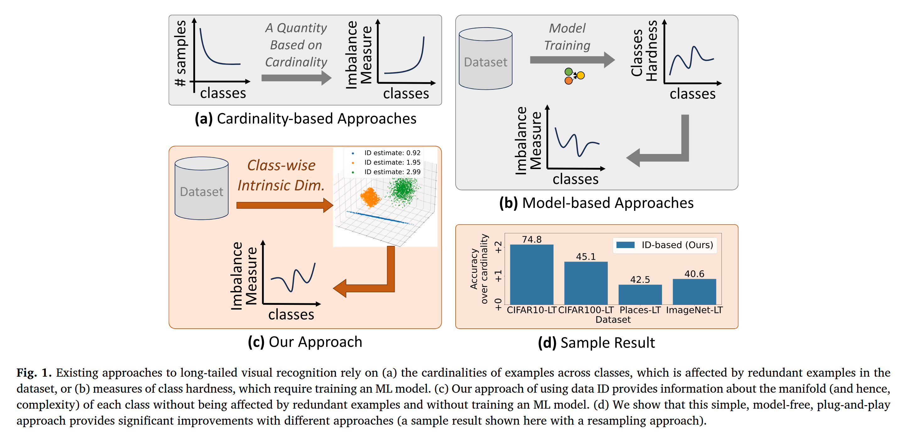
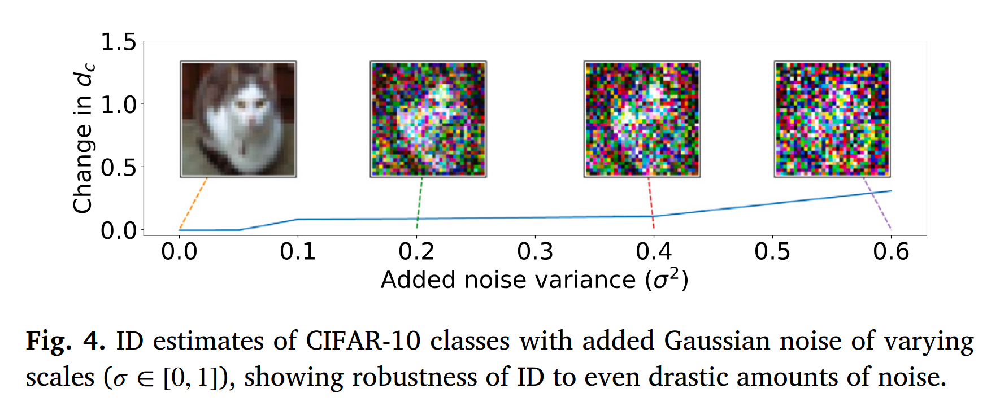
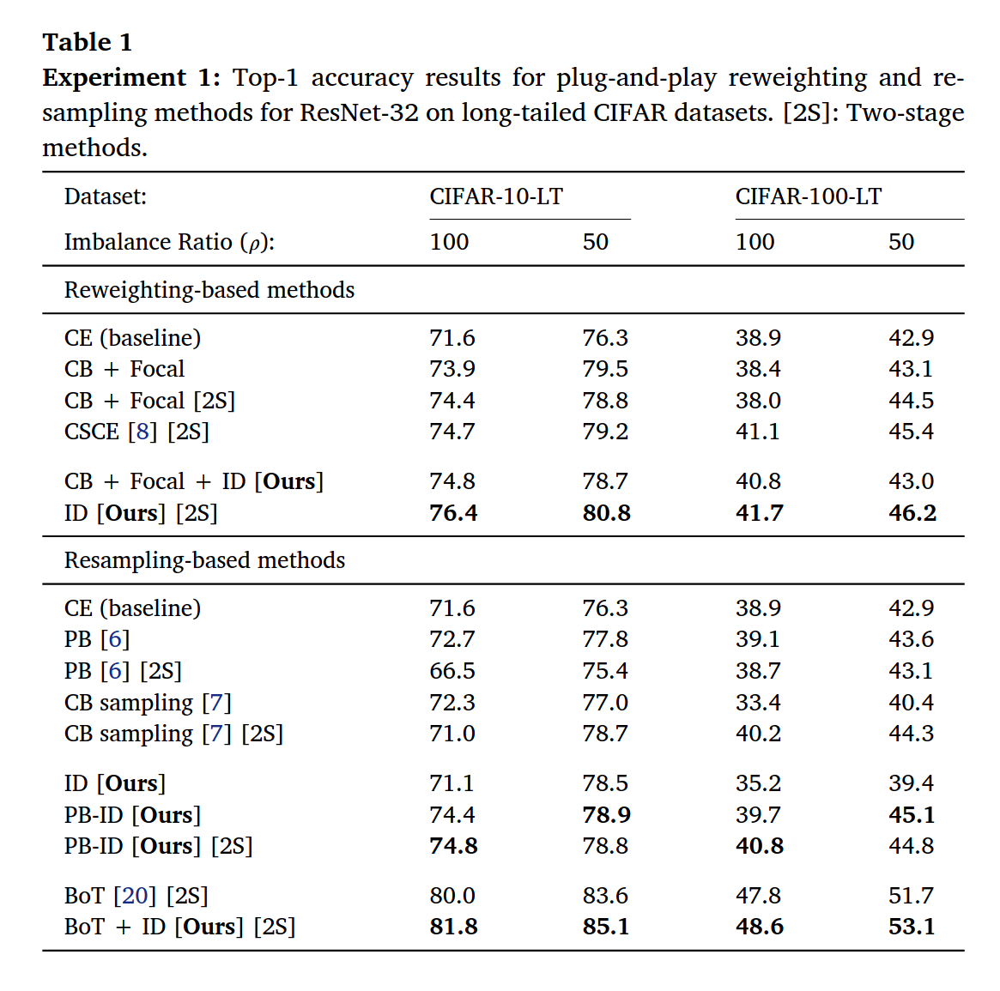
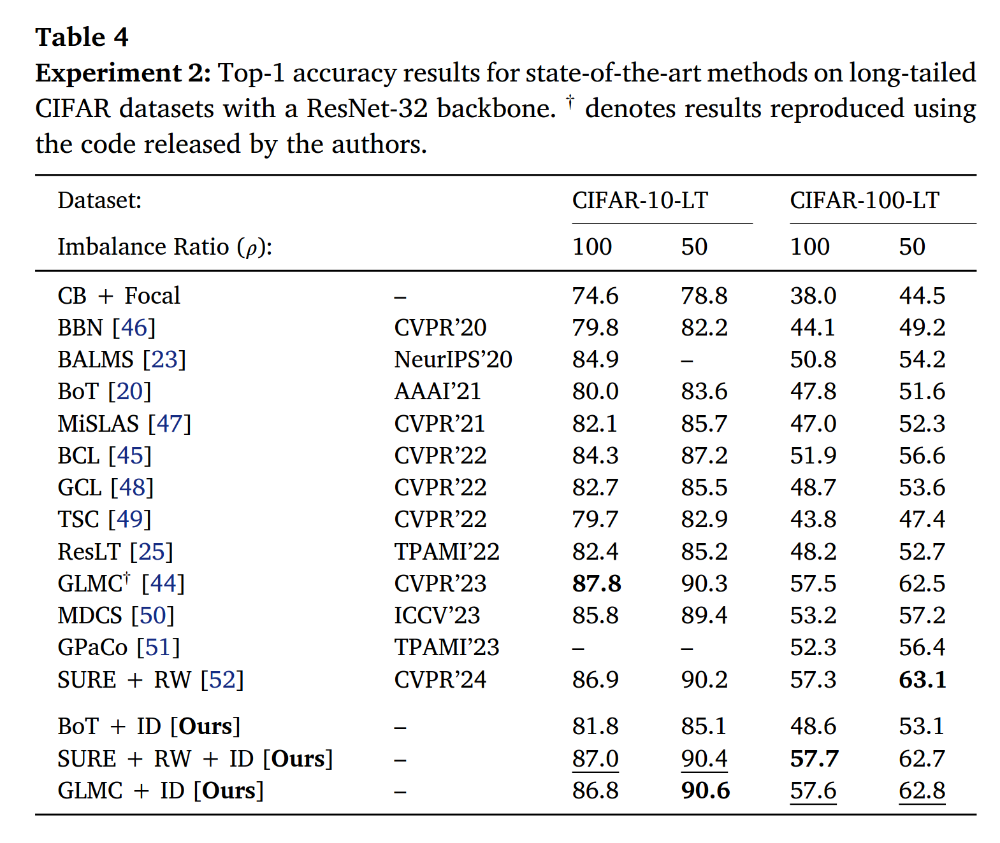
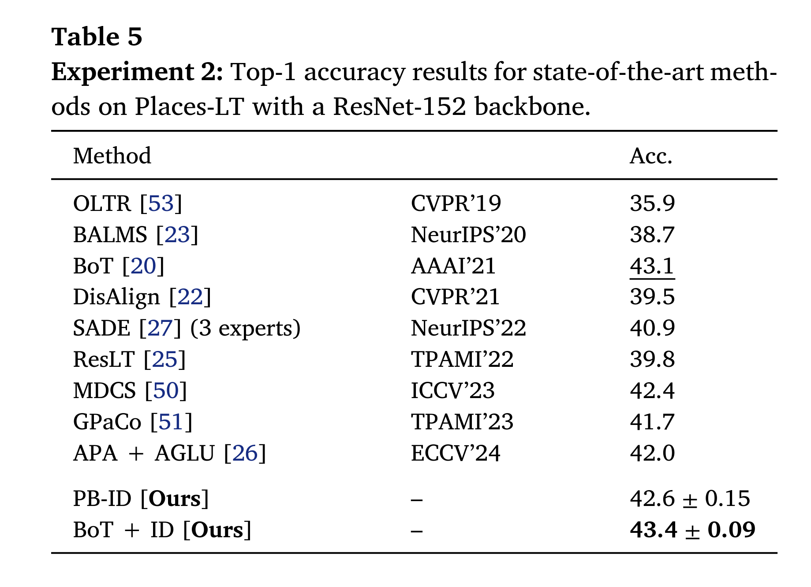
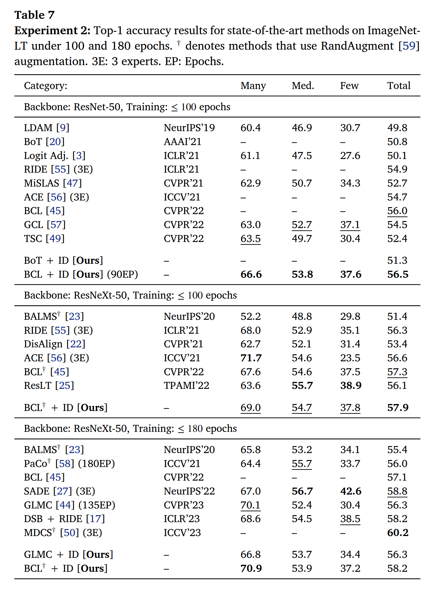

# IDIM - ID as a Model-Free Measure of Class Imbalance

This repository contains the official implementation of the _Neurocomputing_ article:

**“Intrinsic Dimensionality as a Model-Free Measure of Class Imbalance”**  
_Çağrı Eser_, _Zeynep Sonat Baltacı_, _Emre Akbaş_, and _Sinan Kalkan_. \
Neurocomputing 674 (2026) 132938

> Paper: [https://doi.org/10.1016/j.neucom.2026.132938](https://authors.elsevier.com/a/1marD3INukZv%7EU) \
  Preprint: https://arxiv.org/abs/2511.10475





## Table of Contents

- [Setup](#setup)
- [Repository Structure](#repository-structure)
- [Usage](#usage)
  - [Estimating ID](#id-estimation)
  - [Using ID with Long-Tailed Methods](#using-id-with-long-tailed-methods)
- [Results](#results)
- [Pretrained Models](#pretrained-models)
- [Citation](#citation)
- [Contact](#contact)

## Setup

We recommend using Python 3.8+ and a virtual environment (e.g. conda).
Dependencies (for ID estimation) to be installed (via `pip`, `conda`, etc.) include:

- `torch >= 1.12.0` and any appropriate version of `torchvision`
- `numpy`
- `scikit-dimension`
- `tqdm`

For dependencies of individual integrations, please consult the relative README file of the respective method under `methods/`.

## Repository Structure

```
.
├── docs/
├── methods/
│   ├── Bag-of-Tricks/
│   ├── BCL/
│   ├── DRO-LT/
│   ├── GLMC/
│   ├── logit_adjustment/
│   └── SURE/
├── utils/
│   └── id-estimation/
│       ├── id_cifar.py
│       ├── id_imagenet.py
│       ├── id_places.py
│       └── README.md
├── LICENSE
└── README.md
```

## Usage

### ID Estimation

We provide scripts to estimate ID on CIFAR-LT, PlacesLT and ImageNet-LT datasets in the `utils/id-estimation` directory.

### Using ID with Long-Tailed Methods

This directory contains code for using our ID-based method with multiple integrations:
- Bag of Tricks (Zhang et al., 2021)
- Logit Adjustment (Menon et al., 2021)
- DRO-LT (Samuel and Chechik, 2021)
- BCL (Zhu et al., 2022)
- GLMC (Du et al., 2023)
- SURE (Li et al., 2024)

Each method has a dedicated directory under `methods/` with its own instructions and an `ID.md` file describing how to plug in our ID-based measure.

## Results









## Pretrained Models
We release a subset of the models used in the paper.

| Dataset      | Method         | Imbalance Ratio | Top-1 Accuracy | Checkpoints and Logs                                                             |
|--------------|----------------|-----------------|----------------|----------------------------------------------------------------------------------|
| CIFAR-10-LT  | GLMC + ID      | 100             | 87.9           | [link](https://drive.google.com/drive/folders/1h4Oe90T-_9xs9nBxaD6IfkjVoSbuqs6E) |
|              |                | 50              | 90.5           | [link](https://drive.google.com/drive/folders/1gTln0spuuRSISD63XHir7APmi0KL-wcM) |
| CIFAR-100-LT | GLMC + ID      | 100             | 58.0           | [link](https://drive.google.com/drive/folders/1hK5wvfGGL5DsZJ9e6CGDHC-Mo-lFNsEU) |
|              |                | 50              | 62.8           | [link](https://drive.google.com/drive/folders/1sGxknQOH9b81Uxz8NRGi11wuTpeF-ev1) |
| CIFAR-10-LT  | SURE + RW + ID | 100             | 87.0           | [link](https://drive.google.com/drive/folders/1twSOMmAmtpIG9e5G6u66owNXx-X-V7Fd) |
|              |                | 50              | 90.4           | [link](https://drive.google.com/drive/folders/1LyBFeXQRHjvgDA7Y76PeTBIzJ5SKJ-qT) |
| CIFAR-100-LT | SURE + RW + ID | 100             | 57.7           | [link](https://drive.google.com/drive/folders/1t6i-edHB94cWSuDYPpZDNj0vRsZedvf-) |
|              |                | 50              | 62.7           | [link](https://drive.google.com/drive/folders/1FqCFVz7u4z8bFB6vAmhOH-qkZ11uI5uM) |

| Dataset     | Method    | Backbone           | Top-1 Accuracy | Checkpoints and Logs                                                             |
|-------------|-----------|--------------------|----------------|----------------------------------------------------------------------------------|
| Places-LT   | BoT + ID  | ResNet-152         | 43.4           | [link](https://drive.google.com/drive/folders/1Lce2wJAAGWIDqQPfhZQ-f9nY2nhym6-N) |
| ImageNet-LT | BoT + ID  | ResNet-10          | 42.9           | [link](https://drive.google.com/drive/folders/1y7B5i3qSDx-kkrLvMcYvHBdNRstbt2T0) |
| ImageNet-LT | GLMC + ID | ResNeXt-50         | 56.3           | [link](https://drive.google.com/drive/folders/1dRo19x-BwcyY_maCMfIsQsXB_0imGUgp) |
| ImageNet-LT | BCL + ID  | ResNet-50 (90EP)   | 56.5           | [link](https://drive.google.com/drive/folders/17tZZ-ypKN7jSWwv6twmMZuz9e9pQlzc_) |
| ImageNet-LT | BCL + ID  | ResNeXt-50 (90EP)  | 57.9           | [link](https://drive.google.com/drive/folders/1z_uQTyNv0vIWd0Uo_2lk31aqp01SdwGF) |
| ImageNet-LT | BCL + ID  | ResNeXt-50 (180EP) | 58.2           | [link](https://drive.google.com/drive/folders/1zYPJVL0viTG4uLlH-ONfIuX13TcFUTxr) |

### Citation

If you would like to cite this work, please use:

```
@article{eser2026intrinsic,
title = {Intrinsic dimensionality as a model-free measure of class imbalance},
journal = {Neurocomputing},
volume = {674},
pages = {132938},
year = {2026},
issn = {0925-2312},
doi = {https://doi.org/10.1016/j.neucom.2026.132938},
url = {https://www.sciencedirect.com/science/article/pii/S0925231226003358},
author = {Cagri Eser and Zeynep Sonat Baltaci and Emre Akbas and Sinan Kalkan},
keywords = {Intrinsic dimension, Long-tailed visual recognition, Class imbalance, Long-tailed learning},
abstract = {Imbalance in classification tasks is commonly quantified by the cardinalities of examples across classes. This, however, disregards the presence of redundant examples and inherent differences in the learning difficulties of classes. Alternatively, one can use complex measures such as training loss and uncertainty, which, however, depend on training a machine learning model. Our paper proposes using data Intrinsic Dimensionality (ID) as an easy-to-compute, model-free measure of imbalance that can be seamlessly incorporated into various imbalance mitigation methods. Our results across five different datasets with a diverse range of imbalance ratios show that ID consistently outperforms cardinality-based re-weighting and re-sampling techniques used in the literature. Moreover, we show that combining ID with cardinality can further improve performance. Our code and models are available at https://github.com/cagries/IDIM.}
}
```

### Contact

For questions and suggestions, please contact:
- Cagri Eser - cagri.eser@metu.edu.tr
